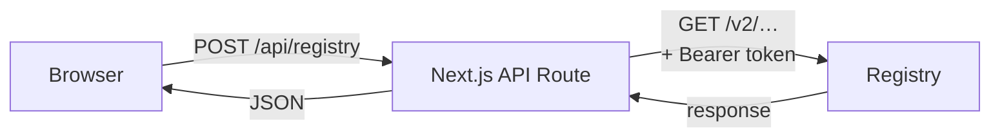
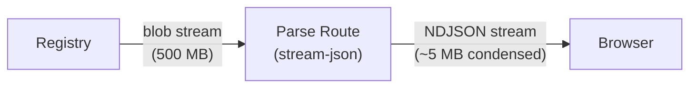
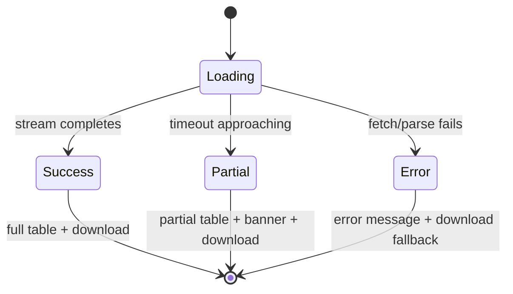
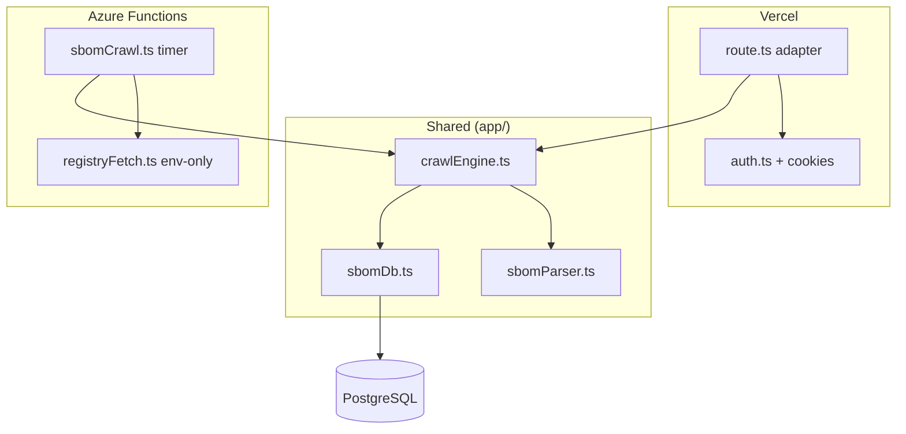

# Architecture Decisions

Architecture decisions for the Artifact Registry Explorer project that ship in **1.0.0**.

---

## 001 — Server-Side Proxy for Registry Communication

**Date**: 2026-05-27

**Context**: OCI registries enforce CORS restrictions. Browser-based `fetch` to registries fails. Credentials must not be exposed to the client.

**Decision**: All registry API calls go through a Next.js API route (`/api/registry`) that proxies requests server-side. Credentials are resolved on the server from an in-memory store, cookies, or environment variables.



**Consequences**:
- No CORS issues
- Credentials never reach the browser
- Adds one network hop (client → server → registry)
- All auth logic is centralized in one proxy route

---

## 002 — SBOM Streaming Parse via NDJSON

**Date**: 2026-03-05

**Context**: SPDX and CycloneDX SBOMs attached as OCI artifacts can be 500 MB+. Vercel serverless functions have a 4.5 MB response body limit for non-streamed responses and a fixed execution timeout per plan (60 s Hobby / 300 s Pro / 900 s Enterprise).

**Decision**: Use a dedicated streaming API route (`/api/registry/blob/parse`) that:
1. Fetches the SBOM blob from the registry
2. Pipes it through `stream-json` (server-side streaming JSON parser)
3. Extracts only the `packages` (SPDX) or `components` (CycloneDX) array
4. Emits each package as a single NDJSON line with only 5 fields: type, namespace, name, version, license
5. First line is metadata: `{ meta: true, format, documentName }`



**Consequences**:
- Server memory stays under ~100 MB regardless of SBOM size (only one chunk in memory at a time)
- Bypasses Vercel's 4.5 MB response body limit (streaming responses are exempt)
- Client receives condensed data progressively — can show a live package counter
- Adds `stream-json` as a dependency (~50 KB)

---

## 003 — Graceful Degradation for Large SBOMs

**Date**: 2026-03-05

**Context**: SBOMs can be arbitrarily large. Function timeout varies by Vercel plan. We cannot guarantee parsing will complete within the timeout.

**Decision**: Always attempt to parse. The streaming parse route tracks elapsed time and self-terminates ~5 s before `maxDuration`, sending a final NDJSON line `{ partial: true, packagesStreamed: N }`. The client shows three possible states:



- **Success**: full searchable/sortable table + download button
- **Partial**: table with received packages + yellow banner ("Showing N packages — SBOM too large to fully parse. Download full SBOM below.") + download button
- **Error**: error message + retry + download fallback

**Consequences**:
- No arbitrary size thresholds to configure
- Users always get something useful (partial data or download)
- Upgrading the Vercel plan automatically increases parsing capacity — no config changes needed
- The download route is a pure stream pipe (zero buffering), so it works for any size within the timeout

---

## 004 — Separate Download Route (Pure Stream Pipe)

**Date**: 2026-03-05

**Context**: Users need to download raw SBOM files. The files can be 500 MB+. We cannot buffer them in memory.

**Decision**: A dedicated download route (`/api/registry/blob/download`) fetches the blob and pipes `response.body` directly to the client with `Content-Disposition: attachment`. Zero buffering — the registry response stream flows straight through.

**Consequences**:
- Works for any blob size within the function timeout
- Browser shows native download progress bar (via `Content-Length` passthrough)
- Completely decoupled from parse logic — download works even if parsing fails

---

## 005 — Shared Auth Extraction

**Date**: 2026-03-05

**Context**: The existing proxy route (`/api/registry/route.ts`) contains ~200 lines of auth/token resolution logic (credential lookup from cookies, 401→token exchange, Azure AD, Docker Hub anonymous). The new blob routes need the same auth logic.

**Decision**: Extract auth logic into `app/api/registry/auth.ts` as reusable functions. All three routes (proxy, blob parse, blob download) import from this shared module.

**Consequences**:
- Single source of truth for auth logic
- Bug fixes apply everywhere
- Easier to test auth in isolation

---

## 006 — Tabbed Panel with Expand Toggle for SBOM Viewing

**Date**: 2026-03-05

**Context**: The existing `ArtifactManifestPanel` shows raw manifest JSON in a slide-in side panel. For SBOM artifacts, users need both the raw manifest and a structured package table view.

**Decision**: When the artifact is an SBOM (detected via `artifactType` matching known SBOM media types), the panel shows two tabs: "Manifest" (existing JSON viewer) and "SBOM" (new table viewer). Default to the "SBOM" tab. An expand toggle in the header widens the panel from `max-w-4xl` (896 px) to `max-w-[90vw]` for better table viewing. Non-SBOM artifacts keep the existing single-view behavior.

**Consequences**:
- No navigation away from the current page
- Expand toggle is simpler than drag-to-resize (no edge cases)
- Raw manifest is still accessible for debugging
- Non-SBOM artifacts are unaffected (no regression)

---

## 007 — Annotation Filtering on Artifact Cards

**Date**: 2026-03-05

**Context**: Supply chain artifact cards show annotation previews. Some annotations are noisy or internal (e.g., `thumbprint#S256` hashes, `org.opencontainers.image.created` timestamps) and clutter the card UI without adding user value.

**Decision**: Filter out annotations matching a blocklist of keys (`org.opencontainers.image.created`) and patterns (`/thumbprint/i`) before rendering the annotation preview on artifact cards. The full annotations remain visible in the manifest JSON view.

**Consequences**:
- Cleaner artifact card display for signatures and other artifacts
- No data loss — filtered annotations are still accessible in the manifest tab
- Easily extensible blocklist for future annotation types

---

## 009 — Playwright E2E Test Suite

**Date**: 2026-05-27

**Context**: The app had no automated tests. Manual QA was done via `scripts/health-check.sh` (API-level) and manual browser testing. As the codebase grew, regressions became harder to catch.

**Decision**: Add a Playwright e2e test suite that can run against any deployment URL via `BASE_URL`. Five spec files cover API health, homepage, navigation, connect flows, and registry/accessibility.

**Key design choices**:

1. **Test against a real deployment**: `playwright.config.ts` defaults to `http://localhost:3000`. Override with `BASE_URL=https://your-deployment.example.com` to point the suite at a deployed environment. No `webServer` block — avoids build+start overhead, and lets you choose where tests run.
2. **No app code changes**: All test infrastructure is in `e2e/` and `playwright.config.ts`. Zero modifications to production source code.
3. **npm scripts**: `npm test` runs full suite, `npm run test:api` for fast API-only checks, `npm run test:ui` for browser tests.

**Consequences**:
- 34 tests provide regression coverage for all major user flows
- API tests (10) are fully deterministic and fast (~4s)
- CI/CD can gate deploys on `npm run test:api` (always stable) while `npm run test:ui` runs as informational

---

## 008 — Multi-Provider Crawl Infrastructure

**Date**: 2026-05-27

**Context**: The SBOM crawl cron runs every minute on Vercel (two partitions, 5-min timeout each), consuming significant serverless function compute time. Vercel Pro charges for compute beyond the included allocation. The crawl logic is tightly coupled to the Next.js App Router (`NextRequest`/`NextResponse`) and `auth.ts` (which imports `cookies()` from `next/headers`). Users with Azure credits want the option to run cron jobs on Azure Functions (10-min timeout, consumption plan) while keeping Vercel for hosting.

**Decision**: Extract all crawl business logic (~230 lines) into a shared `app/lib/crawlEngine.ts` module with zero framework dependencies. The key design choices:

1. **Dependency injection for `fetch`**: The engine accepts a `FetchFn` parameter instead of importing `auth.ts`. The Vercel adapter passes `authenticatedFetch` (supports cookies). The Azure adapter passes `registryFetch` (env-var-only auth). This cleanly severs the `next/headers` dependency.

2. **Single source of truth**: Azure Functions uses `esbuild` with `@/app/*` path aliases resolved to `../../app/*` at build time. No file copying, no duplicate modules. Changes to `sbomDb.ts`, `sbomParser.ts`, or `crawlEngine.ts` are validated by CI for both targets.

3. **`SBOM_CRAWL_PROVIDER` env var**: When set to `azure`, the Vercel cron route short-circuits with 200 in ~0ms. The cron still fires (configured in `vercel.json`) but costs effectively zero compute. This avoids needing conditional `vercel.json` generation.

4. **Single `schema.sql` for all providers**: The only Supabase-specific code (RLS enables) is wrapped in a `DO $$ IF EXISTS (role 'anon') $$` conditional. On Azure PG the block silently skips. One file, zero drift risk.

5. **PostgreSQL over Cosmos DB / GraphQL**: The app's core query is GIN-indexed full-text search (`to_tsvector`/`plainto_tsquery`). Cosmos DB has no native FTS — would require Azure Cognitive Search sidecar. The data model has zero JOINs and zero relationships, so GraphQL adds ceremony with no benefit.



**Consequences**:
- Crawl logic has a single source of truth — bug fixes apply to both Vercel and Azure
- CI catches shared code drift (esbuild + tsc --noEmit on every push)
- Azure Functions gets 10-min timeout (vs Vercel's 5-min) — processes 100 repos/invocation in a single partition
- Adding a third runtime (e.g., AWS Lambda) requires only a new ~30-line adapter

---

## 008 — SBOM Search Performance: Trigram Indexes and Query Routing

**Date**: 2026-05-27

**Context**: The SBOM search needs to handle substring matching (`ILIKE '%openssl%'`) across millions of rows on a modest Postgres instance. PostgreSQL's default approach is a sequential scan — reading every row — which can take 30+ seconds and times out on Vercel's 60s function limit.

**Decision**: Use PostgreSQL **trigram GIN indexes** (`pg_trgm` extension) for fast substring search, with smart query routing based on input pattern detection.

### What is a trigram index?

A trigram index splits text into overlapping 3-character chunks and builds a reverse lookup. Example: `openssl` → `[ope, pen, ens, nss, ssl]`. When you search for `%openssl%`, Postgres looks up which rows contain all those chunks, going directly to matching rows instead of scanning the full table. This turns a multi-second sequential scan into a sub-second index lookup.

### Indexes used by search

| Index | Type | Column | Purpose |
|-------|------|--------|---------|
| `idx_sbom_name_trgm` | GIN trigram | `name` | Default search (most queries) |
| `idx_sbom_namespace_trgm` | GIN trigram | `namespace` | Fallback for Go modules, Java packages |
| `idx_sbom_purl_trgm` | GIN trigram | `purl` | PURL substring search |
| `idx_sbom_version` | btree | `version` | Exact version match |

### Query routing strategy

The search auto-detects query type and routes to the optimal column/index:

| Query pattern | Detection rule | Column searched | Index used |
|---------------|---------------|----------------|------------|
- `pkg:`, `oci/`, `@sha256:` patterns → search `purl` column
- Semver-like patterns (`1.2.3`, `v3.17.1`) → search `version` (exact match)
- Default → search `name`, with `namespace` fallback if 0 results
- Explicit `field:value` syntax overrides auto-detection

Each column has its own dedicated GIN trigram index (`idx_sbom_name_trgm`, `idx_sbom_namespace_trgm`, `idx_sbom_purl_trgm`) plus a btree on `version` for exact match.

### Timeout strategy

- **Data query**: wrapped in `SELECT ... FROM (SELECT ... LIMIT N) sub` to prevent sorting millions of rows
- **Count query**: runs with a short `statement_timeout` — returns `-1` if too slow (UI shows "many results" instead of exact count)
- **Vercel function**: 60-second `maxDuration` for search routes

### Optimization opportunities (not yet implemented)

1. **Domain-pattern detection**: ~~`go.uber.org`, `github.com/...` → search `namespace` first instead of `name` fallback~~ **Reverted** — TLD detection was too broad (`azurecr.io` misrouted to namespace instead of purl). The name→namespace fallback works correctly for these cases, just slightly slower. Needs a more precise detection rule (e.g., starts with `go.` or `github.com/`).
2. **Materialized count cache**: Pre-compute `COUNT(*)` for common high-cardinality queries and refresh periodically — eliminates the count timeout entirely
3. **Connection pooling**: Replace per-request `Pool` with PgBouncer for lower connection overhead under concurrent users

**Consequences**:
- Substring search completes in well under 2 s for most queries on a modest Postgres instance
- PURL, version, and namespace searches all work without upgrading the server
- Count queries for very broad terms may show "many results" instead of an exact count
- Trigram index storage cost is modest relative to the SBOM package data itself.

---

## 009 — Crawl Schedule and Reliability Hardening

**Date**: 2026-05-27

**Context**: Running the crawler against a large public registry surfaced several reliability issues:

1. **Fetch hangs**: Azure Functions would freeze indefinitely when a registry fetch call never completed. No built-in timeout on Node.js `fetch`.
2. **Large repo timeouts**: Some repos have many tags × hundreds of packages. Batching all tag processing into one upsert meant a single repo could exceed the function timeout, losing all progress for that repo.
3. **Stale locks**: When a function died mid-crawl, its lock would persist until TTL expiry, blocking all retries.
4. **24/7 crawling unnecessary**: After initial indexing, daily re-crawls are sufficient. Running crawlers during daytime wastes resources and competes with search queries for DB connections.
5. **Manual stop/start unreliable**: Azure restarts function apps on deploy/settings changes. Manually stopping apps was not persistent.

**Decision**: Three layered fixes:

### 1. Per-request fetch timeout (30s)

Every MCR HTTP request in `registryFetch.ts` now includes `AbortSignal.timeout(30000)`. A hung fetch fails fast after 30 seconds instead of blocking the entire invocation.

### 2. Per-tag checkpointing

The crawl engine's `processRepository` accepts an `onTagComplete` callback. After each tag is processed:
- Packages for that tag are upserted to Postgres
- EOL annotations are upserted
- `lastRepo`, `lastTag`, and `tagsScanned` are updated in crawl state
- Crawl state is saved to Postgres

If the function times out at tag 27 of 50, the next invocation resumes at tag 28 — zero data loss.

### 3. UTC hour gate (configurable crawl window)

A simple `new Date().getUTCHours()` check at the top of the Azure Functions timer handler:
- Compares the current UTC hour against `CRAWL_HOUR_START` / `CRAWL_HOUR_END` env vars and returns immediately when outside the window (no lock, no DB touch)
- Default window 01:00–14:00 UTC covers off-peak hours in the Pacific time zone (both PDT and PST)
- Function apps stay `Running` permanently — no manual intervention needed
- During daytime, the timer fires every 3 minutes but each invocation is ~0 ms

```mermaid
gantt
    title Crawl Schedule (Pacific Time)
    dateFormat HH:mm
    axisFormat %H:%M
    section Daily
    Crawl blocked (daytime)   :crit, 06:00, 12h
    Crawl active (off-peak)   :active, 18:00, 12h
```



### Lock lifecycle

```
Timer fires → Hour check → acquireLock() → crawl repos → renewLock (every 120s) → releaseLock()
                 ↓                ↓
              Skip (daytime)   Fail (locked) → wait for next timer (3 min)
                                                 ↓
                                          Lock expired? → acquireLock deletes it → retry succeeds
```

| Lock event | Timing |
|-----------|--------|
| TTL | 600s (10 min) |
| Renewal | Every 120s |
| Stale override | After 1200s (2× TTL) — forcibly taken |
| Expired cleanup | `DELETE WHERE expires_at < now()` on every `acquireLock` |

**Consequences**:
- Crawls never hang — worst case is a 30s timeout on one fetch, then the tag is retried next invocation
- Progress is never lost — per-tag saves ensure sub-minute granularity
- DB load is isolated to off-hours — search queries get full CPU/IO during daytime
- Zero operational overhead — no cron jobs, no manual stop/start, survives deploys
- Cost-friendly — Azure Functions on the Consumption plan bills $0 during the idle hours when the hour-gate short-circuits

---

## 010 — Incremental Delta Crawl and Storage Bloat Prevention

**Date**: 2026-05-27

**Context**: The first re-crawl after initial indexing was extremely slow — much longer than the nightly window — because every tag was fully re-processed even when nothing had changed. Additionally, the `processed_digests TEXT[]` column in `crawl_state` (a large array of SHA-256 strings, written on every tag checkpoint) caused runaway TOAST-table growth that eventually filled the database disk and crashed every crawl worker.

**Decision**: Two changes:

### 1. Incremental delta crawl — skip known referrers

For each tag, the crawl still makes HEAD (get manifest digest) and GET referrers (discover SBOM/EOL artifacts) — 2 requests. But before downloading and parsing each referrer's blob, it checks if that referrer's artifact digest is already in the DB:

- `sbom_packages.blob_digest` — SBOM artifact digests
- `eol_annotations.artifact_digest` — lifecycle artifact digests

If known → skip the expensive blob download/decompress/parse/upsert (saves 500-2000ms per tag). If unknown → full process as before.

Digests are loaded per-repo via `getKnownArtifactDigestsForRepo(registryId, repo)` which hits the existing `idx_sbom_repo_tag` index (~10-50ms per repo). No upfront full-table scan.

**Why referrer-level skip, not manifest-level skip**: When a new SBOM or EOL is attached to an existing tag, the tag's manifest digest does NOT change (referrers are stored separately in OCI). Skipping at the manifest level would miss new artifacts on existing tags. The referrers API call (always executed) detects new artifacts because their digest won't be in the known set.

### 2. Stop persisting `processed_digests` to DB

`putCrawlState()` now always writes `[]` for the `processed_digests` column instead of the actual array (which could grow to tens of thousands of SHA-256 strings = several MB per write). Multiplied by every tag checkpoint across every partition, the previous behavior caused TOAST-table growth on the order of gigabytes per night, eventually filling the disk and forcing PostgreSQL into read-only mode.

The `digestSet` for within-invocation manifest dedup stays in memory only. It's rebuilt from scratch each Azure Functions invocation. Cross-invocation dedup is handled by the delta skip (DB-backed, not state-backed).

**Consequences**:
- Re-crawl time: drops by an order of magnitude after the first delta cycle, since unchanged tags skip the expensive blob download/decompress/parse/upsert
- DB storage from crawl state: bounded — no longer grows with each checkpoint
- New SBOMs/EOL on existing tags: detected via referrers API (always called)
- New repos/tags: detected because their referrer digests aren't in DB
- Search: completely unaffected (different code path, different columns)
- Schema: `processed_digests` column remains but is always empty — no migration needed
