# Artifact Registry Explorer — Technical Design

> OCI-compatible container registry explorer built with Next.js 16, React 19, and TypeScript.

## Architecture

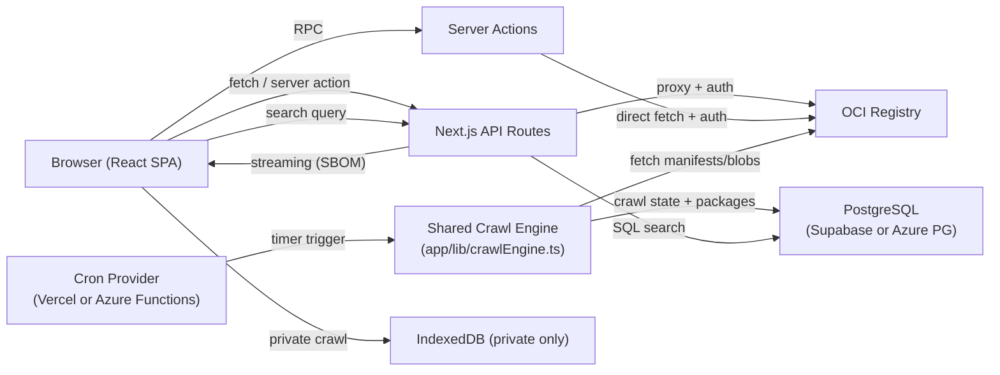

All registry communication is **server-side only** — the browser never talks to registries directly. This avoids CORS issues and keeps credentials off the client.

### Multi-Provider Architecture

The crawl engine is extracted into a **framework-agnostic module** (`app/lib/crawlEngine.ts`) with zero Next.js dependencies. Both the Vercel cron route and Azure Functions timer trigger consume it via dependency injection:

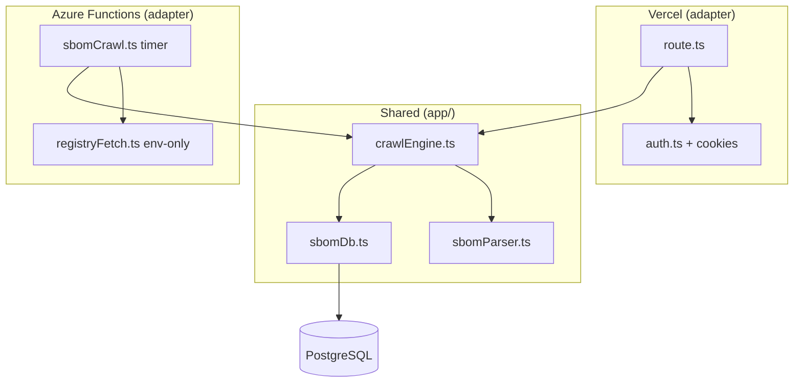

The `SBOM_CRAWL_PROVIDER` env var controls which runtime handles crawling:
- **Not set / `vercel`**: Vercel cron route runs the crawl
- **`azure`**: Vercel cron returns 200 immediately (~0ms); Azure Functions runs the crawl
- **No `DATABASE_URL`**: All SBOM features disabled

## Module Map

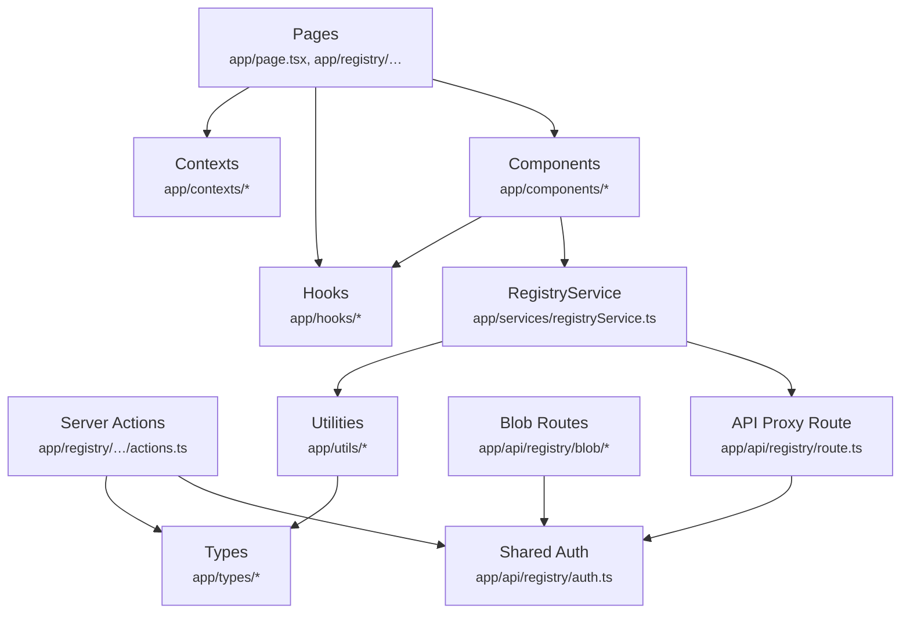

## API Flows

### Auth — Token Exchange

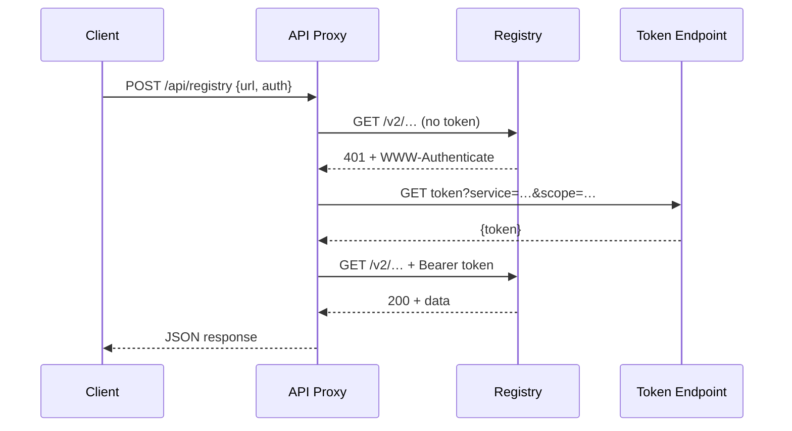

### Repository + Tag Browsing

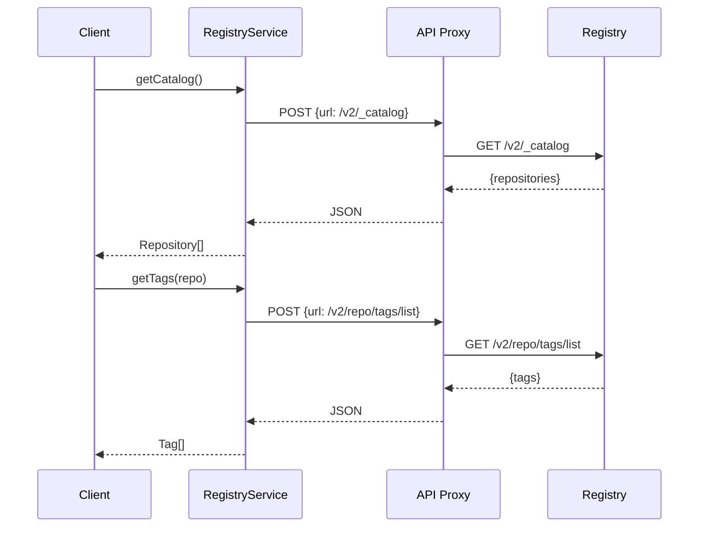

### Supply Chain Artifact Discovery

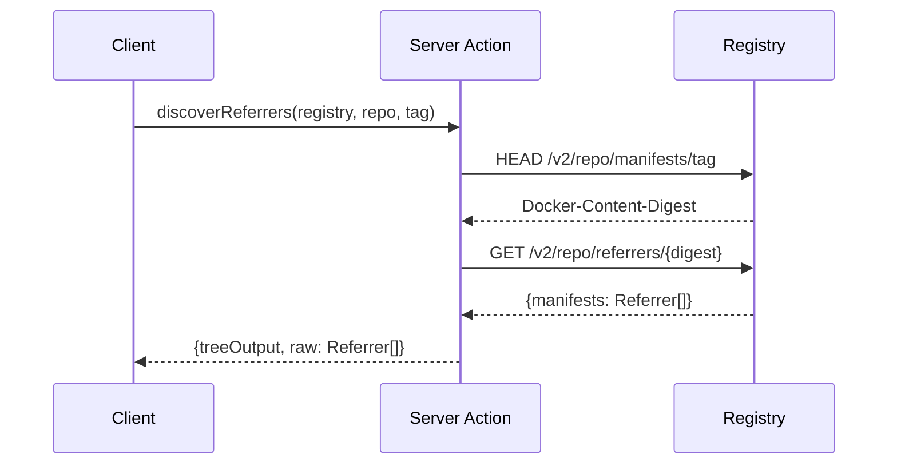

### SBOM Streaming Parse

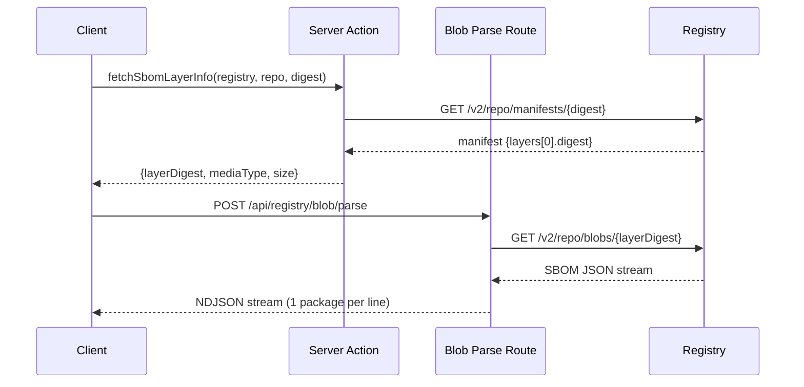

### SBOM Download

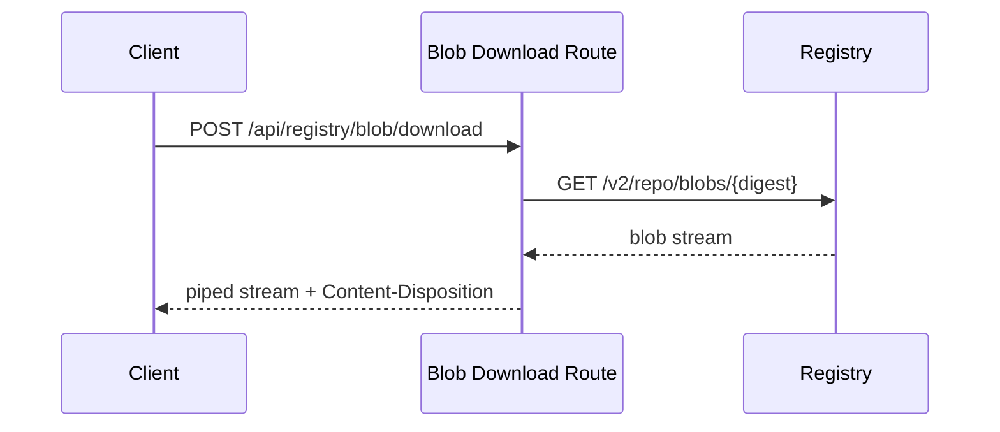

## Security

- **In-memory credentials** — never stored in localStorage
- **Server-side proxy** — browser never contacts registries directly
- **No persistent tokens** — auth tokens are per-request
- **Session persistence opt-in** — cookies expire with browser session
- **Direct credential priority** — inline creds preferred over store lookups

## Deployment

| Setting | Value |
|---------|-------|
| Output mode | `standalone` |
| Runtime | Node.js (serverless on Vercel) |
| Streaming | Blob parse/download routes use `ReadableStream` to bypass 4.5 MB body limit |

### Vercel Function Timeouts

| Plan | `maxDuration` | Practical SBOM ceiling (at ~20 MB/s) |
|------|---------------|--------------------------------------|
| Hobby | 60 s | ~500 MB–1 GB |
| Pro | 300 s | ~3–5 GB |
| Enterprise | 900 s | ~10 GB+ |

Streaming parse is **timeout-aware** — the function self-terminates ~5 s before the limit, returning a partial result with a flag so the UI can show what it has plus a download fallback.

## SBOM Cross-Registry Search

Search SBOM packages (name, namespace, version, publisher, PURL, license) across all repositories in a registry. MCR is pre-indexed via server-side cron; private registries use on-demand client-side crawling.

### Crawl Pipeline (Shared Engine)

The crawl logic lives in `app/lib/crawlEngine.ts` and is invoked by either a Vercel cron route or Azure Functions timer trigger. The `fetchFn` parameter is dependency-injected — Vercel passes `authenticatedFetch` (supports cookies), Azure passes `registryFetch` (env-var-only auth).

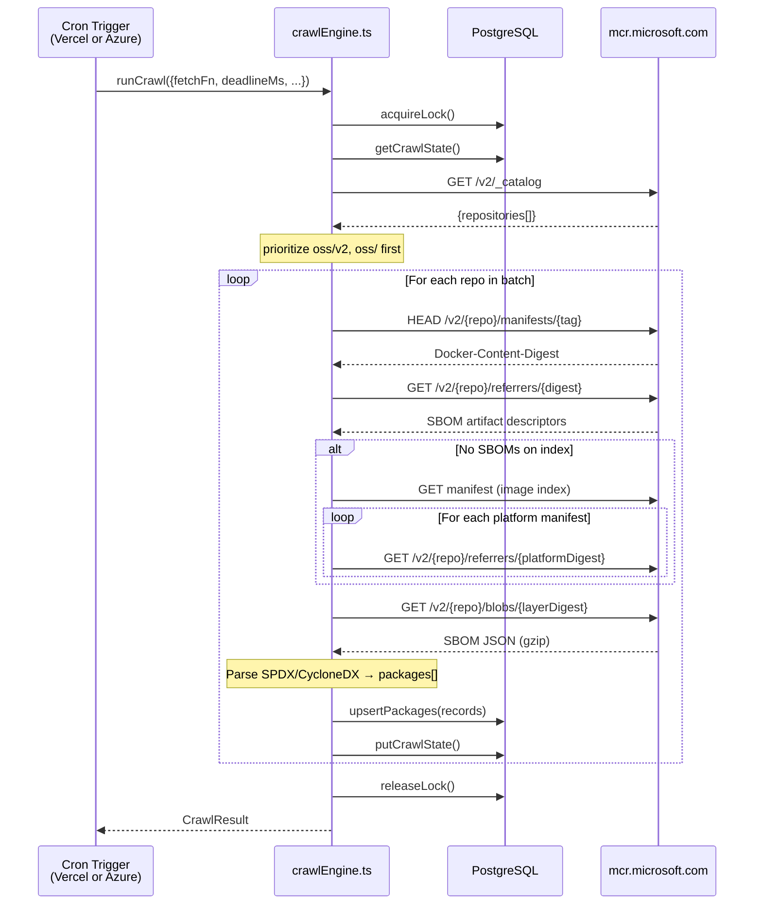

| Config | Vercel Adapter | Azure Functions Adapter |
|--------|---------------|------------------------|
| Schedule | Every 2 min (2 partitions) | Every 3 min (4 workers, p0–p3) |
| Timeout | 5 min (Pro plan) | 10 min (Consumption) |
| Repos/invocation | 50 | 100 |
| Schedule window | N/A | Configurable (default 01:00–14:00 UTC, i.e. off-peak Pacific time) |
| Auth | `authenticatedFetch` (cookies + env vars) | `registryFetch` (env vars only) |
| `fetchFn` | From `app/api/registry/auth.ts` | From `infra/azure-functions/src/lib/registryFetch.ts` |
| Fetch timeout | None (Vercel enforces 5 min) | 30s `AbortSignal.timeout` per request |
| Checkpointing | Per-repo | Per-tag via `onTagComplete` callback |
| Lock TTL | 600s | 600s with 120s renewal interval |

### Client Search Flow

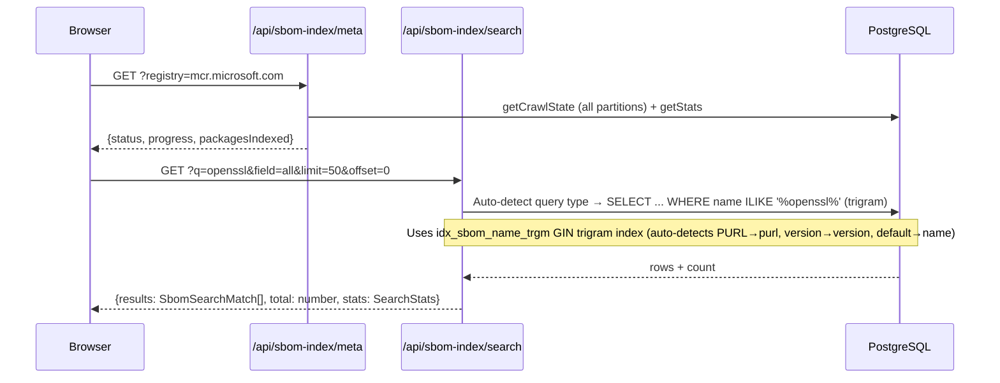

### Deployment Options

The crawl infrastructure supports four deployment configurations:

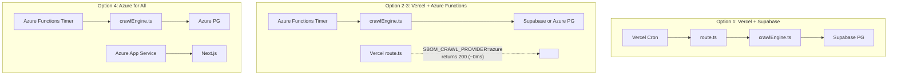

    C0 -->|"hash(repo) % 2 == 0"| S0
    C0 --> W0
    C0 --> L0
    C1 -->|"hash(repo) % 2 == 1"| S1
    C1 --> W1
    C1 --> L1

    C0 -.->|"reads W0 + W1"| IDX
    C1 -.->|"reads W0 + W1"| IDX
```

Each partition:
- Has its **own lock** → no mutual blocking
- Has its **own crawl state** → independent cursor/resume
- Has its **own working blob** → no concurrent write races
- **Published index** is a merge of all partition working blobs (deduplicated)
- Cron schedules are **staggered** (`*/2` vs `1-59/2`) so they never publish simultaneously
- Snapshot publish runs every 3rd batch (not every invocation) to avoid 504 timeouts as blobs grow
- `totalRepos` stores the full catalog count before partitioning so the UI shows accurate progress

### SBOM Attachment Points

The crawler checks referrers at three levels:

| Level | Manifest Type | When Checked |
|-------|---------------|-------------|
| Image Index | `application/vnd.oci.image.index.v1+json` | Always (HEAD manifest) |
| Manifest List | `application/vnd.docker.distribution.manifest.list.v2+json` | Always (HEAD manifest) |
| Platform Manifest | Per-architecture image | When no SBOMs found on index |

### SBOM Parsing Pipeline

The crawler's `parseSbomBlob` matches the supply chain SBOM viewer (`/api/registry/blob/parse`) exactly:

```
Blob bytes → gzip detect/decompress → JSON parse
  → in-toto unwrap (if _type + predicate present)
  → detectSbomFormat()
  → primary key lookup (formatInfo.arrayKey)
  → fallback: scan [packages, components, @graph, dependencies, artifacts, elements]
  → deep search: one level down into any object key
  → extract via format-specific extractor (SPDX 2.x / SPDX 3.0 / CycloneDX)
```

**In-toto attestation envelopes** are the most common wrapper in MCR's `oss/v2/` namespace:

```json
{
  "_type": "https://in-toto.io/Statement/v0.1",
  "predicateType": "https://spdx.dev/Document",
  "subject": [...],
  "predicate": {           // ← actual SBOM
    "spdxVersion": "SPDX-2.3",
    "packages": [...]
  }
}
```

The parser detects `_type` + `predicate` and swaps to the inner object before format detection.

### Feature Flag

UI visibility is controlled by a **local storage toggle** (click copyright text in footer). The server env gate (`DATABASE_URL`) controls whether actual indexing functionality works. Both are independent:

| Server Gate | Local Flag | Result |
|-------------|-----------|--------|
| ✅ Set | ✅ Enabled | Full functionality |
| ✅ Set | ❌ Hidden | Feature works but UI hidden |
| ❌ Not set | ✅ Enabled | Page visible but shows "not configured" |
| ❌ Not set | ❌ Hidden | Feature completely hidden |

### Client Search — Advanced Query Syntax

The search box supports structured `field:value` filters alongside free-text search:

```
openssl                          → search all fields for "openssl"
name:openssl                     → only search the Name field
openssl publisher:microsoft      → "openssl" in all fields AND publisher = "microsoft"
name:cert version:1.17 license:Apache  → multi-field AND filter
purl:pkg:npm namespace:github    → PURL and namespace filters
name:"my package"                → quoted values for spaces
```

**Implementation:** `parseSearchQuery()` in `sbomDb.ts` (server) and `sbomIndexDb.ts` (client) extracts `field:value` tokens via regex, removes them from the query string, and returns a `ParsedSearchQuery` with both `text` (free-text portion) and `filters[]` (structured AND conditions). Server-side: mapped to SQL `ILIKE` clauses. Client-side (private registries): cursor scan with JS `includes()`.

### EOL Annotation Search

The crawl engine captures lifecycle annotations (`application/vnd.microsoft.artifact.lifecycle`) from the same referrers API call used for SBOMs — zero additional HTTP requests for discovery. EOL data is stored in the `eol_annotations` table.

#### Unified Search Page

The `/registry/search` page has two tabs:

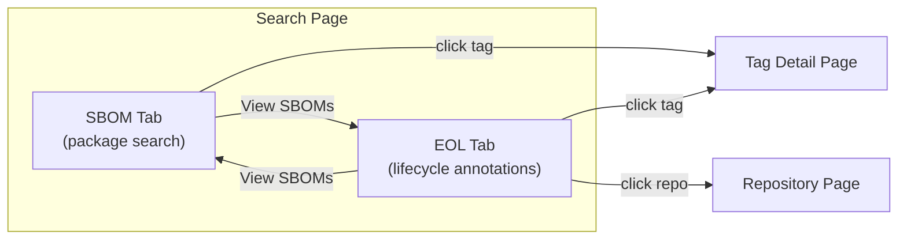

- **SBOM tab**: Full-text search by package name/version/publisher/PURL/license. Results include EOL status indicators (cross-referenced via `batchGetEolForTags()`).
- **EOL tab**: Filter by status (Expired/Warning/Upcoming), date range, and repository. Sortable columns, CSV export, "View SBOMs" link (only shown when SBOMs exist for that tag).

#### EOL API Endpoints

| Endpoint | Purpose |
|----------|---------|
| `GET /api/sbom-index/eol?status=expired&repo=dotnet&limit=50` | Search EOL annotations with filters |
| `GET /api/sbom-index/eol?mode=stats` | Counts by status: `{ expired, warning, upcoming, total }` |
| `GET /api/sbom-index/search?includeEol=true` | SBOM search with EOL cross-reference |

#### Cross-Linking

- **SBOM → EOL**: SBOM results show EOL status (`eolDate`, `eolStatus`) when `includeEol=true` is set
- **EOL → SBOM**: "View SBOMs" button switches to SBOM tab filtered by repo+tag (only visible when `hasSboms=true`)
- **EOL → Tag**: Tag links navigate to the tag detail page (existing EOL banner)
- **EOL → Repo**: Repo links navigate to the repository page (browse all tags)

### Database Tables (PostgreSQL)

Works with Supabase, Azure Database for PostgreSQL, or any PostgreSQL 14+. Schema: `docs/schema.sql` (idempotent, safe to re-run).

| Table | Purpose |
|-------|--------|
| `sbom_packages` | One row per package **per tag** — unique on `(registry_id, repo, sample_tag, name, version, purl)` with GIN full-text index (`fastupdate = off`) + trigram index |
| `eol_annotations` | EOL lifecycle annotations — one row per tag with a lifecycle artifact `(registry_id, repo, tag, digest, eol_date)` |
| `crawl_state` | Per-partition crawl cursor/progress — one row per `{registry}-p{N}` |
| `crawl_locks` | Distributed lock — one row per partition with `expires_at` for TTL |
| `sbom_stats` | Materialized view — pre-computed `COUNT(DISTINCT ...)` for fast stats. Refreshed after each crawl cycle. |

**Per-repo upsert architecture:** Each crawl invocation processes repos one at a time. After parsing all SBOMs for a single repo, packages and EOL annotations are immediately upserted to Postgres and crawl state is saved. This ensures:

1. **No data loss on timeout** — packages from completed repos are already in the database
2. **Progress survives crashes** — state saved after each repo, next invocation resumes from the last incomplete tag
3. **No transaction wrapper** — each INSERT is auto-committed independently, avoiding Supabase transaction pooler timeouts
4. **In-batch deduplication** — packages are deduplicated by `(registry_id, repo, sample_tag, name, version, purl)` before INSERT to prevent "cannot affect row a second time" errors

| Operation | Scope | Duration | Survives timeout? |
|-----------|-------|----------|-------------------|
| `processTag` | 1 tag | 1-30s | Yes (upsert + state save after each tag via `onTagComplete` callback) |
| `upsertPackages` | 1 tag's packages | 0.5-5s | N/A (independent commits) |
| `upsertEolAnnotations` | 1 tag's EOL | ~50ms | N/A (independent commits) |
| `putCrawlState` | 1 row update | ~50ms | N/A |

**Per-tag state saves:** The `processRepository` function accepts an `onTagComplete` callback that the main `runCrawl` loop provides. After each tag is processed, the callback:
1. Upserts packages for that tag to Postgres
2. Upserts EOL annotations for that tag
3. Updates `lastRepo` and `lastTag` in crawl state
4. Saves crawl state to Postgres

This means a heavy repo with 50 tags × 500 packages never needs to complete in a single invocation. If the function times out at tag 27, the next invocation resumes at tag 28 with zero data loss. Previously, all 50 tags' packages were batched and upserted after the entire repo, which caused 10-minute timeouts on heavy repos.

Search queries use trigram `ILIKE` with smart auto-detection for query routing. The system detects PURL patterns (`pkg:`, `oci/`, `@sha256:`) → searches `purl` column, semver-like patterns (`^\d+[.\-\d]`) → exact match on `version` column, and defaults to `name` column with `namespace` fallback if 0 results. All queries use subquery LIMIT to prevent sorting millions of rows. Count queries run with a 10-second `statement_timeout`. All queries are parameterized (`$1, $2, ...`) to prevent SQL injection.

### Query Performance

| Optimization | Purpose |
|---|---|
| **Progressive COUNT** | Data query returns instantly with EXPLAIN estimate; background `countOnly=true` call fetches exact COUNT and auto-updates the UI |
| **EXPLAIN estimate** | `EXPLAIN (FORMAT JSON)` returns PostgreSQL's planner row estimate in ~1ms — used as initial total before exact count arrives |
| **GIN fastupdate = off** | Prevents pending list accumulation during concurrent writes — ensures the GIN index is always up-to-date for reads |
| **No ORDER BY for full-text** | Full-text search queries skip `ORDER BY name` to force PostgreSQL to use the GIN index instead of falling back to a B-tree scan + filter |
| **Exact match for repo/tag** | When repo contains `/` or tag looks like a version, uses `=` instead of `ILIKE` — hits B-tree index directly |
| **Trigram index (pg_trgm)** | Fast `ILIKE '%openssl%'` single-field search via GIN trigram index |
| **Materialized view** | Pre-computed `COUNT(DISTINCT ...)` for stats — refreshed after each crawl cycle, read in ~1ms |
| **pg_class.reltuples** | Real-time row count during active indexing — updated by autovacuum, ~1ms |
| **maxDuration = 60** | Search route `countOnly` queries get 60s Vercel timeout instead of default 15s |
| **ANALYZE** | Must be run after large bulk inserts to update table statistics for the query planner |

### Crawl Lifecycle

```
Idle → Crawling → Complete → 12h wait → Idle (new cycle)
```

1. **Idle**: No crawl in progress. Timer trigger starts a new cycle.
2. **Crawling**: Repos processed in batches per invocation (50 on Vercel, 100 on Azure Functions). Each repo: fetch tags → check referrers → skip known referrers (delta) → parse new SBOMs → upsert to Postgres. State saved after each tag via `onTagComplete` callback.
3. **Complete**: All repos in the partition scanned. Timer checks and skips for the recrawl interval (default 12 hours).
4. **New cycle**: After the recrawl interval, state resets and crawl starts from repo 0. All partitions reset together when the next crawl window opens.

### Delta Crawl (Incremental Re-indexing)

After the initial crawl, re-crawls skip unchanged content:

| Step | Per tag | Skippable? |
|------|---------|------------|
| HEAD manifest | 1 req (~200ms) | No — needed to get digest |
| GET referrers | 1 req (~200ms) | No — needed to detect new SBOMs/EOL |
| Check referrer digests | DB lookup | — |
| GET SBOM blob + parse | 1-3 reqs (~1-2s) | **Yes — skipped if digest known** |
| DB upsert | ~100ms | **Yes — skipped if digest known** |

Per-repo known digests loaded from `sbom_packages.blob_digest` and `eol_annotations.artifact_digest` via `getKnownArtifactDigestsForRepo()` — hits `idx_sbom_repo_tag` index (~10-50ms).

**Detection guarantees**: New SBOM or EOL on an existing tag is detected because the referrers API returns the new artifact’s digest, which won’t be in the known set.

### Crawl Schedule

Azure Functions timer fires every 3 minutes. A UTC hour gate at the top of the handler skips crawling outside the configured window (`CRAWL_HOUR_START` / `CRAWL_HOUR_END`, default 01:00–14:00 UTC — off-peak hours in the Pacific time zone, covering both PDT and PST).

Function apps stay `Running` permanently — no manual stop/start. Outside the window, each invocation returns immediately (~0 ms, no DB touch, no lock acquired).

### Crawl Reliability

| Safeguard | Description |
|-----------|-------------|
| 30s fetch timeout | `AbortSignal.timeout(30000)` on every MCR HTTP request |
| Per-tag checkpointing | `onTagComplete` callback saves state after each tag — survives mid-repo timeouts |
| Lock renewal | 600s TTL with 120s renewal interval — prevents stale locks from blocking retries |
| Stale lock override | If lock age > 2× TTL (1200s), new invocation forcibly takes the lock |
| Expired lock cleanup | Each `acquireLock` call deletes locks where `expires_at < now()` |
| Deadline buffer | Function stops 20s before Azure's hard timeout |
| Storage bloat prevention | `putCrawlState()` always writes `[]` for `processed_digests` — bounded TOAST growth |
## Release History

| Version | Date | Highlights |
|---------|------------|------------|
| 1.0.0 | 2026-05-27 | Initial public release — registry browsing, SBOM viewer, supply-chain artifacts, optional cross-registry SBOM + EOL search, multi-provider crawl, four deployment options |

## Tech Stack

- **Framework**: Next.js 16.0.7 (App Router, Turbopack)
- **UI**: React 19, TypeScript 5, Tailwind CSS
- **State**: React Context + TanStack React Query
- **Components**: Radix UI (Tabs, Tooltip, Slot)
- **Streaming**: stream-json (server-side SBOM parsing)
- **Database** (optional): PostgreSQL — Supabase, Azure PG, or any PostgreSQL 14+ (pg driver) — SBOM search + crawl state
- **Crawl runtime** (optional): Vercel Cron or Azure Functions (shared engine via DI)
- **Infrastructure** (optional): ARM template for Azure deployment
- **Registry protocol**: OCI Distribution Specification
